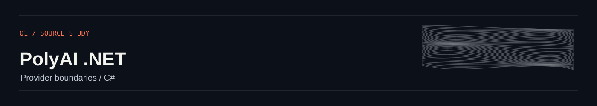
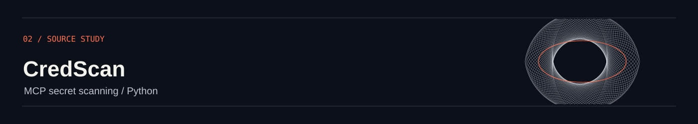
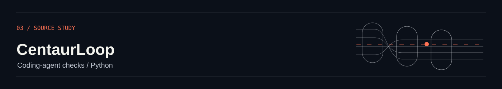
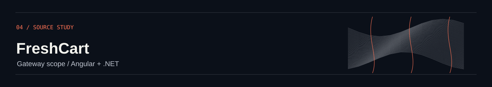
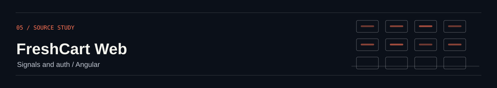
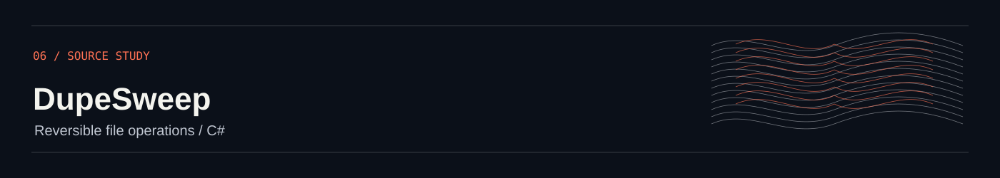
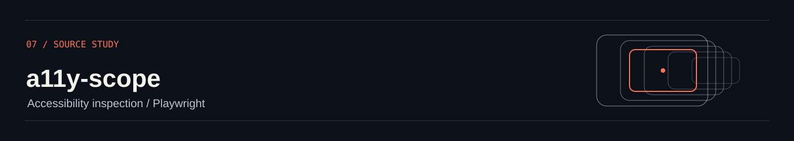

# Ama Senevirathne

**AI / agent engineer · Full-stack software engineer**

[Discuss an engineering role](mailto:amabandarasp@gmail.com?subject=Engineering%20role%20%E2%80%94%20Ama%20Senevirathne) · [LinkedIn](https://www.linkedin.com/in/ama-sen/) · [DEV.to](https://dev.to/amasen) · [X](https://x.com/amasen02) · [GitHub](https://github.com/amasen02)

  <picture>
    <source media="(prefers-reduced-motion: reduce)" srcset="assets/hero-static.svg">
    
  </picture>

I build the systems around AI: provider integrations, tool calling, security tooling, distributed backends, and the interfaces people use.

## AI & agent systems

<a href="https://github.com/amasen02/polyai-dotnet"><picture><source media="(prefers-reduced-motion: reduce)" srcset="assets/plate-polyai-dotnet-static.svg"></picture></a>

### [PolyAI .NET](https://github.com/amasen02/polyai-dotnet)
C# multi-provider SDK with streaming, structured output, and runtime tool discovery. Tool schemas follow runtime types and reject unsupported parameter shapes. [README](https://github.com/amasen02/polyai-dotnet/blob/main/README.md) · [ToolRegistry](https://github.com/amasen02/polyai-dotnet/blob/main/src/PolyAI/Tools/ToolRegistry.cs) · [Provider routing](https://github.com/amasen02/polyai-dotnet/blob/main/src/PolyAI/Extensions/PolyAIRouter.cs)

<a href="https://github.com/amasen02/credscan"><picture><source media="(prefers-reduced-motion: reduce)" srcset="assets/plate-credscan-static.svg"></picture></a>

### [CredScan](https://github.com/amasen02/credscan)
Python scanning for source, staged changes, and agent configuration. It inspects MCP environment values, headers, and arguments, and reads Git index blobs so staged content is scanned as staged. [Agent artifacts](https://github.com/amasen02/credscan/blob/main/src/credscan/agent_artifacts.py) · [Git integration](https://github.com/amasen02/credscan/blob/main/src/credscan/git_integration.py)

<a href="https://github.com/amasen02/centaurloop-agent-governor"><picture><source media="(prefers-reduced-motion: reduce)" srcset="assets/plate-centaurloop-agent-governor-static.svg"></picture></a>

### [CentaurLoop](https://github.com/amasen02/centaurloop-agent-governor)
Python experiments for coding-agent guardrails: syntax checks, forbidden-phrase checks, and compact execution logs. [Implementation](https://github.com/amasen02/centaurloop-agent-governor/blob/master/src/governor.py)

## Full-stack systems

<a href="https://github.com/amasen02/freshcart-backend"><picture><source media="(prefers-reduced-motion: reduce)" srcset="assets/plate-freshcart-backend-static.svg"></picture></a>

### [FreshCart Backend](https://github.com/amasen02/freshcart-backend)
A .NET / Aspire reference backend with an Angular storefront. Checkout state explicitly models stock and payment success or failure; activities and consumers isolate side effects; payment events and a projection marker share one MongoDB transaction. [Checkout state machine](https://github.com/amasen02/freshcart-backend/blob/master/src/Services/Ordering/FreshCart.Ordering.Application/Checkout/CheckoutSagaStateMachine.cs) · [Payment event store](https://github.com/amasen02/freshcart-backend/blob/master/src/Services/Payment/FreshCart.Payment.Infrastructure/EventStore/MongoPaymentEventStore.cs) · [Build and test workflow](https://github.com/amasen02/freshcart-backend/blob/master/.github/workflows/reusable-build-test.yml)

## More source

<a href="https://github.com/amasen02/freshcart-web"><picture><source media="(prefers-reduced-motion: reduce)" srcset="assets/plate-freshcart-web-static.svg"></picture></a>

### [FreshCart Web](https://github.com/amasen02/freshcart-web)
Angular storefront with signals and HttpOnly-cookie sessions. [Auth boundary](https://github.com/amasen02/freshcart-web/blob/master/src/app/core/http/credentials.interceptor.ts)

<a href="https://github.com/amasen02/dupesweep"><picture><source media="(prefers-reduced-motion: reduce)" srcset="assets/plate-dupesweep-static.svg"></picture></a>

### [DupeSweep](https://github.com/amasen02/dupesweep)
C# duplicate-file tooling with reversible quarantine and restore.

<a href="https://github.com/amasen02/a11y-scope"><picture><source media="(prefers-reduced-motion: reduce)" srcset="assets/plate-a11y-scope-static.svg"></picture></a>

### [a11y-scope](https://github.com/amasen02/a11y-scope)
Accessibility monitoring with Playwright and axe-core. [README](https://github.com/amasen02/a11y-scope/blob/main/README.md)

## Engineering range

- **AI integrations and tools** — C# provider boundaries, JSON Schema, streaming, and structured output. [Evidence](https://github.com/amasen02/polyai-dotnet/blob/main/README.md)
- **Agent security** — Python inspection of MCP configuration and staged Git content. [Evidence](https://github.com/amasen02/credscan/blob/main/src/credscan/agent_artifacts.py)
- **Distributed systems** — MassTransit state machines and transactional event storage. [Evidence](https://github.com/amasen02/freshcart-backend/blob/master/src/Services/Ordering/FreshCart.Ordering.Application/Checkout/CheckoutSagaStateMachine.cs)
- **Data and recovery** — MongoDB event storage and projection markers in one transaction. [Evidence](https://github.com/amasen02/freshcart-backend/blob/master/src/Services/Payment/FreshCart.Payment.Infrastructure/EventStore/MongoPaymentEventStore.cs)
- **Frontend** — Angular, TypeScript, signals, and a deliberately scoped auth boundary. [README](https://github.com/amasen02/freshcart-web/blob/master/README.md) · [Auth boundary](https://github.com/amasen02/freshcart-web/blob/master/src/app/core/http/credentials.interceptor.ts)
- **Delivery and accessibility** — reusable restore, build, and test workflow; Playwright and axe-core monitoring described in the project README. [Workflow](https://github.com/amasen02/freshcart-backend/blob/master/.github/workflows/reusable-build-test.yml) · [README](https://github.com/amasen02/a11y-scope/blob/main/README.md)

<!-- BEGIN AUTO-CONTRIBUTIONS -->

## Open-source contributions

**9 verified merged pull requests across 9 repositories**. [Live GitHub search](https://github.com/search?q=author%3Aamasen02%20-user%3Aamasen02%20is%3Apr%20is%3Amerged%20is%3Apublic&amp;type=pullrequests)

**Repositories:** [apmantza/pi-lens](https://github.com/apmantza/pi-lens) · [atretyak1985/swarmery](https://github.com/atretyak1985/swarmery) · [BerriAI/litellm](https://github.com/BerriAI/litellm) · [calibrain/shelfmark](https://github.com/calibrain/shelfmark) · [felladrin/MiniSearch](https://github.com/felladrin/MiniSearch) · [MihaelaAghirculesei/n8n-probe](https://github.com/MihaelaAghirculesei/n8n-probe) · [schubydoo/clauster](https://github.com/schubydoo/clauster) · [theagentplane/tokenops](https://github.com/theagentplane/tokenops) · [wemake-services/django-modern-rest](https://github.com/wemake-services/django-modern-rest)

## Selected upstream merges

- **[BerriAI/litellm](https://github.com/BerriAI/litellm/pull/39729)** — Made budget resets invalidate the affected end-user spend counter and cache.
- **[apmantza/pi-lens](https://github.com/apmantza/pi-lens/pull/2568)** — Overlapped auxiliary LSP warmup with the primary server during resync.
- **[schubydoo/clauster](https://github.com/schubydoo/clauster/pull/1485)** — Avoided appending a redundant .gitignore rule when an existing rule already covers the path.

Full merged-PR catalog (9)

#### [apmantza/pi-lens](https://github.com/apmantza/pi-lens)

- [fix(lsp): overlap auxiliary LSP warmup with primary server during resync (#2540)](https://github.com/apmantza/pi-lens/pull/2568)

#### [atretyak1985/swarmery](https://github.com/atretyak1985/swarmery)

- [docs(skills): state negative boundaries in frontmatter descriptions (#284)](https://github.com/atretyak1985/swarmery/pull/289)

#### [BerriAI/litellm](https://github.com/BerriAI/litellm)

- [fix(proxy): invalidate end-user spend counter and cache on budget reset (#39726)](https://github.com/BerriAI/litellm/pull/39729)

#### [calibrain/shelfmark](https://github.com/calibrain/shelfmark)

- [fix(postprocess): attach unmatched chaptered audio files to existing book group (#1176)](https://github.com/calibrain/shelfmark/pull/1309)

#### [felladrin/MiniSearch](https://github.com/felladrin/MiniSearch)

- [ci: fix biome.json schema version mismatch warning (#2529)](https://github.com/felladrin/MiniSearch/pull/2530)

#### [MihaelaAghirculesei/n8n-probe](https://github.com/MihaelaAghirculesei/n8n-probe)

- [test: extract shared vitest base config to de-duplicate n8n-workflow alias (#7)](https://github.com/MihaelaAghirculesei/n8n-probe/pull/10)

#### [schubydoo/clauster](https://github.com/schubydoo/clauster)

- [fix(config-write): skip redundant .gitignore append when existing rule covers path (#1484)](https://github.com/schubydoo/clauster/pull/1485)

#### [theagentplane/tokenops](https://github.com/theagentplane/tokenops)

- [docs(policies): point docs at docs/policies/ and document trajectory\_hint exception (#68)](https://github.com/theagentplane/tokenops/pull/73)

#### [wemake-services/django-modern-rest](https://github.com/wemake-services/django-modern-rest)

- [refactor(json): rename \\json\_dump\\ to \\json\_dumps\\ (#1399)](https://github.com/wemake-services/django-modern-rest/pull/1400)

<!-- END AUTO-CONTRIBUTIONS -->

---

_Sources: public GitHub repository and pull-request records._
